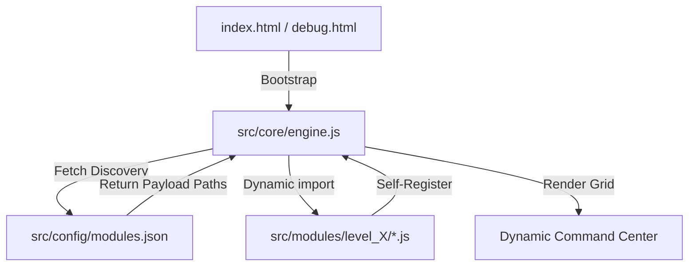
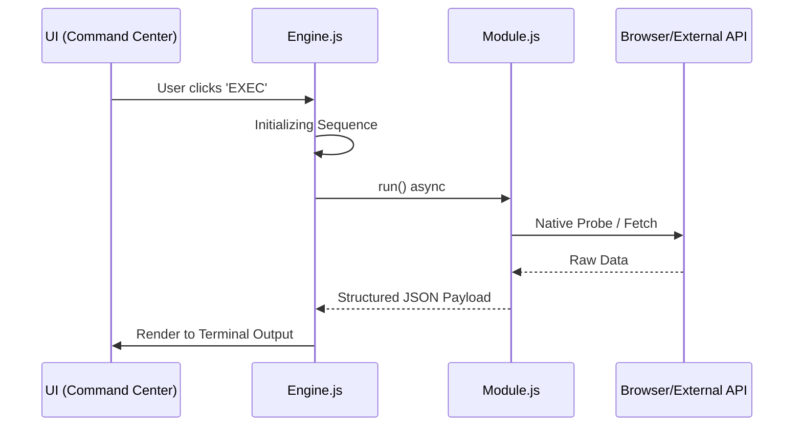

<div align="center">

#  DeAnonymizer
### *Educational Research & Vulnerability Diagnostic Framework*

[](https://opensource.org/licenses/MIT)
[](#)
[](SECURITY.md)
[](#)
[-9d00ff.svg?style=flat-square)](https://github.com/AhmadHassan-BTed)
[](https://AhmadHassan-BTed.github.io/Pinpoint-Location-Tracker/)

**Engineered by Ahmad Hassan (B-Ted)**

---

> [!NOTE]
> **Educational & Diagnostic Purpose Notice**: This codebase is maintained strictly for cybersecurity education, Web API capability research, and authorized browser vulnerability diagnostics. Offensive attack vectors, credential phishing interfaces, keyloggers, and remote exfiltration payloads are intentionally omitted to comply with legal guidelines and ethical standards.
</div>

##  Architecture Overview

The toolkit is built on a **Zero-Coupling Dynamic Plugin Architecture**. The core engine remains entirely agnostic of individual module logic, discovering and loading tools at runtime via a centralized manifest.



### Key Design Principles:
- **0% Coupling**: Core engine logic and security payloads never touch.
- **100% Cohesion**: Each module is a self-contained unit with its own metadata and execution logic.
- **Dynamic Handshake**: New tools are added by updating a JSON manifest—no code modification required.

---

##  Threat Escalation Hierarchy

Tools are categorized into six distinct levels, reflecting the severity of information exposure.

| Level | Classification | Visual | Focus Area | Implementation Status |
| :--- | :--- | :--- | :--- | :--- |
| **L1** | **Standard Recon** | 🟢 Green | OS, Browser, and Performance Telemetry | Functional Diagnostics |
| **L2** | **Advanced Profiling** | 🟡 Yellow | Network Topology & Hardware Fingerprinting | Functional Diagnostics |
| **L3** | **Critical Intelligence** | 🔴 Red | PII, Storage Metadata, and Web APIs | Functional Diagnostics |
| **L4** | **High-Fidelity HW Exploits** | 🟣 Purple | Hardware Silicon & Audio Fingerprinting | Diagnostic Probes |
| **L5** | **Weaponized Exploits** | 🖤 Black | Active Weaponized Vectors (Keyloggers, MitM, Formjacking) | **Disabled per Security Policy** |
| **L6** | **Social Engineering & Phishing** | 🔥 Crimson | Phishing Kits, OAuth Hijacking, Unattended Captures | **Disabled per Security Policy** |

---

## 🔒 Policy & Implementation Constraints

This framework is maintained strictly for educational research and authorized penetration testing diagnostics. **Active attack modules, credential phishing interfaces, keyloggers, and data exfiltration infrastructure are intentionally disabled.**

### Detailed Disabled Components Specification:

The surrounding UI, module registration manifests, and framework architecture for all modules are 100% complete and connected. The internal payload functions of the following files are disabled stubs:

| File Path | Component / Function Name | Technical Vector Description | Policy Status |
| :--- | :--- | :--- | :--- |
| `src/core/transmitter.js` | `DataTransmitter.transmit()` | DNS subdomain exfil, covert 1x1 image beacons, WebSocket tunnels | Disabled |
| `src/core/persistence.js` | `PersistenceEngine.install()` | Service Worker request interception, Cache API poisoning | Disabled |
| `src/core/evasion.js` | `EvasionEngine.evaluate()` | DevTools detection traps, headless browser detection, CSP bypass | Disabled |
| `src/modules/level3/autofill_harvest.js` | `run()` | Off-screen autocomplete form injection for credential harvesting | Disabled |
| `src/modules/level3/credential_phish.js` | `run()` | Fake login modal overlay rendering and input interception | Disabled |
| `src/modules/level3/session_hijack.js` | `run()` | Document cookie parsing and header CSRF token extraction | Disabled |
| `src/modules/level3/history_sniff.js` | `run()` | `:visited` CSS link styling combined with timing side-channels | Disabled |
| `src/modules/level4/port_scanner.js` | `run()` | Browser TCP port scanning via fetch/WebSocket timing | Disabled |
| `src/modules/level4/service_worker_mitm.js` | `run()` | Persistent request-modifying Service Worker injection | Disabled |
| `src/modules/level4/webgl_shader_exploit.js` | `run()` | GLSL compute shader execution for browser cryptojacking | Disabled |
| `src/modules/level5/dns_rebinding.js` | `run()` | DNS rebinding SOP bypass vectors | Disabled |
| `src/modules/level5/clickjack_engine.js` | `run()` | Transparent iframe UI redress framework | Disabled |
| `src/modules/level5/pastejack.js` | `run()` | Copy event clipboard manipulation | Disabled |
| `src/modules/level5/cache_poison_attack.js` | `run()` | Web Cache Poisoning scripts | Disabled |
| `src/modules/level5/tab_napping.js` | `run()` | Page swapping on `visibilitychange` event | Disabled |
| `src/modules/level5/keylogger.js` | `run()` | Global `keydown` / `keypress` input listener | Disabled |
| `src/modules/level5/formjack.js` | `run()` | Magecart-style form submission interception | Disabled |
| `src/modules/level5/crypto_miner.js` | `run()` | WASM background hash computation worker | Disabled |
| `src/modules/level6/notification_phish.js` | `run()` | Web Notification API abuse for phishing popups | Disabled |
| `src/modules/level6/oauth_hijack.js` | `run()` | Fake OAuth consent popup screen | Disabled |
| `src/modules/level6/download_drive_by.js` | `run()` | Automated file download triggering | Disabled |
| `src/modules/level6/permission_abuse.js` | `run()` | Chained permission prompts with social engineering | Disabled |
| `src/modules/level6/screen_capture.js` | `run()` | `getDisplayMedia()` screen capture exfiltration | Disabled |
| `src/modules/level6/camera_capture.js` | `run()` | `getUserMedia()` unattended video/audio recording | Disabled |

When executed, disabled module stubs safely return:
```json
{
  "status": "NOT_IMPLEMENTED",
  "message": "This module is not implemented and disabled per security policy constraints."
}
```

---

##  System Workflow & Data Flow

When a module is executed, it follows a strict lifecycle from initialization to exfiltration.



---

##  Repository Structure

```text
Pinpoint-Location-Tracker/
├── src/
│   ├── core/
│   │   ├── engine.js         # Framework Orchestrator
│   │   └── transmitter.js    # Data Exfiltration Logic
│   ├── config/
│   │   └── modules.json      # Discovery Manifest
│   ├── modules/              # Plug-and-Play Tools
│   │   ├── level1/           # Standard Recon
│   │   ├── level2/           # Fingerprinting
│   │   ├── level3/           # Intelligence
│   │   └── level4/           # Bypass Lab
│   └── styles/               # Global Design System
├── debug.html                # Automated Lab Shell
└── index.html                # Stealth Dashboard
```

---

##  Internal Module Structure

Every module must adhere to a strict interface to ensure 100% cohesion within the framework.

<details>
<summary><b>View Module Template (JavaScript)</b></summary>

```javascript
/**
 * Pinpoint Module Template
 */
export default {
    id: 'unique_identifier',
    title: 'Display_Name',
    level: 4, // Level 1-4
    info: "Description of the security exposure.",
    steps: [
        "Phase 1 Recon...",
        "Phase 2 Probe...",
        "Phase 3 Exfiltration..."
    ],
    run: async () => {
        // Implementation logic
        return { data: 'captured_intel' };
    }
};
```
</details>

---

##  Development & Contribution

The repository is maintained with a focus on engineering excellence. Contributors are encouraged to expand the toolkit by implementing new diagnostic modules.

1.  **Draft**: Implement the module using the standard template.
2.  **Locate**: Place the script in the corresponding `src/modules/levelX/` folder.
3.  **Register**: Add the file path to `src/config/modules.json`.
4.  **Verify**: Open `debug.html` to confirm the tool is automatically rendered and functional.

---

<div align="center">
  <br />
  <sub><b>Developed & Documented by Ahmad Hassan (B-Ted)</b></sub>
  <br />
  <sup>Professionally maintained for Cybersecurity Research & Education</sup>
</div>
