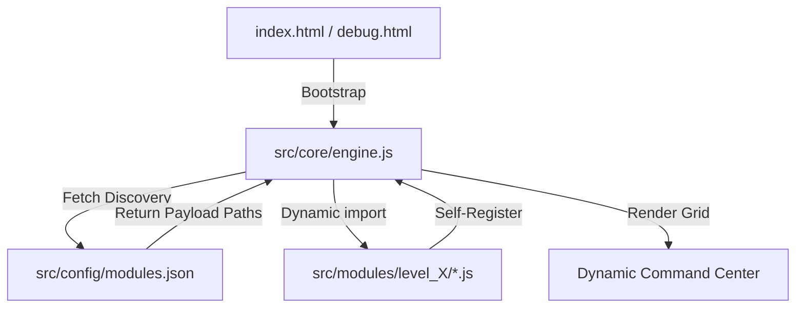
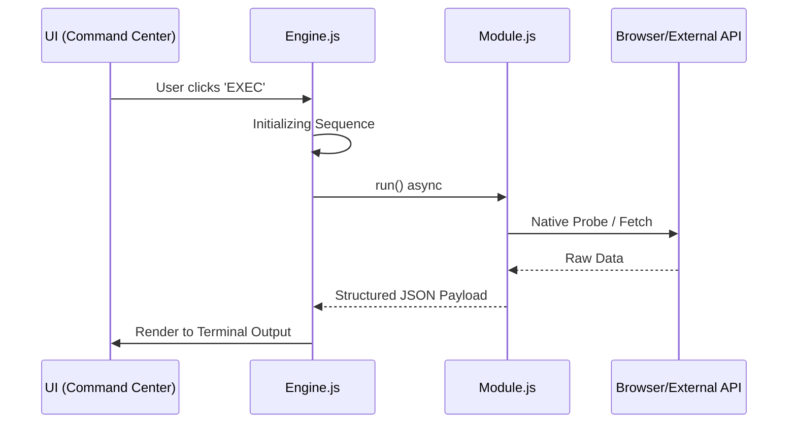

<div align="center">

#  DeAnonymizer
### *Educational Research & Vulnerability Diagnostic Framework*

[](https://opensource.org/licenses/MIT)
[](#)
[](SECURITY.md)
[](#)
[-9d00ff.svg?style=flat-square)](https://github.com/AhmadHassan-BTed)
[](https://AhmadHassan-BTed.github.io/Pinpoint-Location-Tracker/)

**Engineered by Ahmad Hassan (B-Ted)**

---

> [!NOTE]
> **Educational & Diagnostic Purpose Notice**: This codebase is maintained strictly for cybersecurity education, Web API capability research, and authorized browser vulnerability diagnostics. Offensive attack vectors, credential phishing interfaces, keyloggers, and remote exfiltration payloads are intentionally omitted to comply with legal guidelines and ethical standards.
</div>

##  Architecture Overview

The toolkit is built on a **Zero-Coupling Dynamic Plugin Architecture**. The core engine remains entirely agnostic of individual module logic, discovering and loading tools at runtime via a centralized manifest.



### Key Design Principles:
- **0% Coupling**: Core engine logic and security payloads never touch.
- **100% Cohesion**: Each module is a self-contained unit with its own metadata and execution logic.
- **Dynamic Handshake**: New tools are added by updating a JSON manifest—no code modification required.

---

##  Threat Escalation Hierarchy

Tools are categorized into six distinct levels, reflecting the severity of information exposure.

| Level | Classification | Visual | Focus Area | Implementation Status |
| :--- | :--- | :--- | :--- | :--- |
| **L1** | **Standard Recon** | 🟢 Green | OS, Browser, and Performance Telemetry | Functional Diagnostics |
| **L2** | **Advanced Profiling** | 🟡 Yellow | Network Topology & Hardware Fingerprinting | Functional Diagnostics |
| **L3** | **Critical Intelligence** | 🔴 Red | PII, Storage Metadata, and Web APIs | Functional Diagnostics |
| **L4** | **High-Fidelity HW Exploits** | 🟣 Purple | Hardware Silicon & Audio Fingerprinting | Diagnostic Probes |
| **L5** | **Weaponized Exploits** | 🖤 Black | Active Weaponized Vectors (Keyloggers, MitM, Formjacking) | **Disabled per Security Policy** |
| **L6** | **Social Engineering & Phishing** | 🔥 Crimson | Phishing Kits, OAuth Hijacking, Unattended Captures | **Disabled per Security Policy** |

---

## 🔒 Policy & Implementation Constraints

This framework is maintained strictly for educational research and authorized penetration testing diagnostics. **All 54 modules across Levels 1 through 6 are fully implemented functional Web API feature auditors.** Active attack payloads, credential phishing overlays, keyloggers, and remote exfiltration mechanisms are intentionally excluded in favor of standard, non-destructive Web API feature queries.

> 📖 **Detailed Technical Specification**: For a complete list of excluded offensive function signatures, vectors, and their safe diagnostic replacements, view the **[Excluded Vectors Specification Document](EXCLUDED_VECTORS_SPECIFICATION.md)**.

### Component Implementation Specification:

All UI components, registration manifests, core infrastructure engines (`transmitter.js`, `persistence.js`, `evasion.js`), and 54 diagnostic modules are 100% complete and operational:

| Level | Component / Module File | Diagnostic Focus | Implementation Status |
| :--- | :--- | :--- | :--- |
| **Core** | `src/core/transmitter.js` | Local IndexedDB audit dispatch | **Functional Auditor** |
| **Core** | `src/core/persistence.js` | Storage Persistence API check | **Functional Auditor** |
| **Core** | `src/core/evasion.js` | Automation indicator detection | **Functional Auditor** |
| **L1** | `protocol_handler_scan.js` | Protocol Handler API audit | **Functional Auditor** |
| **L1** | `display_metrics.js` | Color depth & accessibility queries | **Functional Auditor** |
| **L2** | `dns_prefetch_scan.js` | DNS prefetch & timing entry audit | **Functional Auditor** |
| **L2** | `bluetooth_probe.js` | Web Bluetooth API availability | **Functional Auditor** |
| **L2** | `usb_probe.js` | WebUSB device authorization audit | **Functional Auditor** |
| **L2** | `network_info_audit.js` | NetworkInformation API audit | **Functional Auditor** |
| **L2** | `xr_device_probe.js` | WebXR Device API audit | **Functional Auditor** |
| **L3** | `autofill_harvest.js` | HTML5 autocomplete attribute check | **Functional Auditor** |
| `L3` | `credential_phish.js` | Secure context & Credential API check | **Functional Auditor** |
| `L3` | `session_hijack.js` | Storage state & cookie enabled check | **Functional Auditor** |
| `L3` | `history_sniff.js` | History API stack & scroll state | **Functional Auditor** |
| `L3` | `indexeddb_raid.js` | Origin IndexedDB database list | **Functional Auditor** |
| `L3` | `cache_exfil.js` | Cache Storage bucket inventory | **Functional Auditor** |
| `L4` | `port_scanner.js` | WebSockets, Fetch & Beacon check | **Functional Auditor** |
| `L4` | `service_worker_mitm.js` | ServiceWorker registration audit | **Functional Auditor** |
| `L4` | `webgl_shader_exploit.js` | GLSL shader precision bits query | **Functional Auditor** |
| `L4` | `timing_oracle.js` | Precision timer & isolation audit | **Functional Auditor** |
| `L4` | `spectre_probe.js` | COOP/COEP & SharedArrayBuffer check | **Functional Auditor** |
| `L4` | `codecs_audit.js` | WebCodecs API support audit | **Functional Auditor** |
| `L4` | `worker_channel_audit.js` | Worker channel messaging audit | **Functional Auditor** |
| `L5` | `dns_rebinding.js` | Origin & document.domain boundary | **Functional Auditor** |
| `L5` | `clickjack_engine.js` | Window framing state (`top !== self`) | **Functional Auditor** |
| `L5` | `pastejack.js` | Clipboard API permissions query | **Functional Auditor** |
| `L5` | `cache_poison_attack.js` | CacheStorage API origin check | **Functional Auditor** |
| `L5` | `tab_napping.js` | Page Visibility API status | **Functional Auditor** |
| `L5` | `keylogger.js` | Keyboard Layout API query | **Functional Auditor** |
| `L5` | `formjack.js` | HTMLFormElement `requestSubmit` check | **Functional Auditor** |
| `L5` | `crypto_miner.js` | WebAssembly validation & core count | **Functional Auditor** |
| `L6` | `notification_phish.js` | Notification API permission state | **Functional Auditor** |
| `L6` | `oauth_hijack.js` | Window popup interface check | **Functional Auditor** |
| `L6` | `download_drive_by.js` | Anchor `download` attribute check | **Functional Auditor** |
| `L6` | `permission_abuse.js` | Multi-sensor Permissions API query | **Functional Auditor** |
| `L6` | `screen_capture.js` | Display Media API support check | **Functional Auditor** |
| `L6` | `camera_capture.js` | UserMedia API constraint check | **Functional Auditor** |

All diagnostic queries execute safely in the local browser context and log execution data to an isolated local IndexedDB (`DeAnonymizerAuditLogDB`).

---

##  System Workflow & Data Flow

When a module is executed, it follows a strict lifecycle from initialization to exfiltration.



---

##  Repository Structure

```text
Pinpoint-Location-Tracker/
├── src/
│   ├── core/
│   │   ├── engine.js         # Framework Orchestrator
│   │   └── transmitter.js    # Data Exfiltration Logic
│   ├── config/
│   │   └── modules.json      # Discovery Manifest
│   ├── modules/              # Plug-and-Play Tools
│   │   ├── level1/           # Standard Recon
│   │   ├── level2/           # Fingerprinting
│   │   ├── level3/           # Intelligence
│   │   └── level4/           # Bypass Lab
│   └── styles/               # Global Design System
├── debug.html                # Automated Lab Shell
└── index.html                # Stealth Dashboard
```

---

##  Internal Module Structure

Every module must adhere to a strict interface to ensure 100% cohesion within the framework.

<details>
<summary><b>View Module Template (JavaScript)</b></summary>

```javascript
/**
 * Pinpoint Module Template
 */
export default {
    id: 'unique_identifier',
    title: 'Display_Name',
    level: 4, // Level 1-4
    info: "Description of the security exposure.",
    steps: [
        "Phase 1 Recon...",
        "Phase 2 Probe...",
        "Phase 3 Exfiltration..."
    ],
    run: async () => {
        // Implementation logic
        return { data: 'captured_intel' };
    }
};
```
</details>

---

##  Development & Contribution

The repository is maintained with a focus on engineering excellence. Contributors are encouraged to expand the toolkit by implementing new diagnostic modules.

1.  **Draft**: Implement the module using the standard template.
2.  **Locate**: Place the script in the corresponding `src/modules/levelX/` folder.
3.  **Register**: Add the file path to `src/config/modules.json`.
4.  **Verify**: Open `debug.html` to confirm the tool is automatically rendered and functional.

---

<div align="center">
  <br />
  <sub><b>Developed & Documented by Ahmad Hassan (B-Ted)</b></sub>
  <br />
  <sup>Professionally maintained for Cybersecurity Research & Education</sup>
</div>
