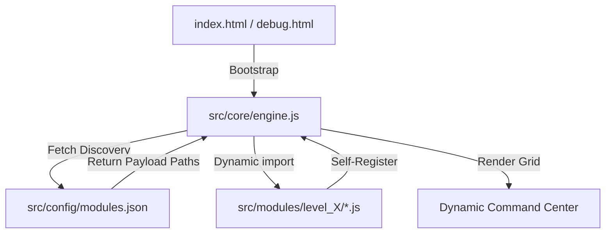
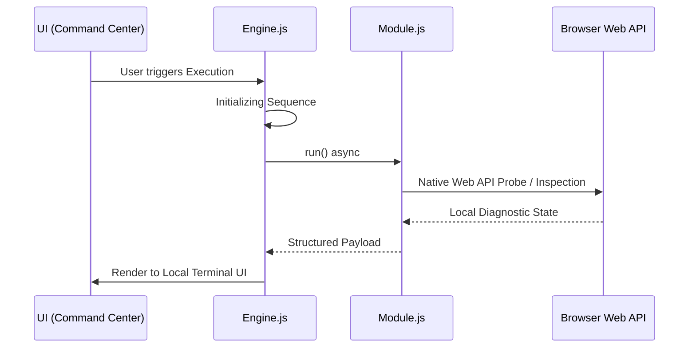

<div align="center">

# SilentSniffer
### *Educational Research & Web Security Diagnostic Sandbox*

[](https://opensource.org/licenses/MIT)
[](#)
[](SECURITY.md)
[](#)
[-9d00ff.svg?style=flat-square)](https://github.com/AhmadHassan-BTed)
[](https://AhmadHassan-BTed.github.io/Pinpoint-Location-Tracker/)

**Engineered by Ahmad Hassan (B-Ted)**

---

> [!NOTE]
> **Browser Privacy & Awareness Notice**: Modern web applications operate under the widespread assumption that browsing is inherently safe, private, and isolated by default. **SilentSniffer** is built to challenge this false sense of security. Operating strictly as a self-contained, client-side sandbox, **zero data is exported or transmitted anywhere**. Instead, it offers a real-time, visual demonstration of just how much ambient device state, hardware telemetry, and behavioral data can slip out of a user's control without explicit consent—simply because modern browser specifications permit it by default.
</div>

## 💡 The Philosophy Behind SilentSniffer

Most internet users assume that unless they explicitly click "Allow" on a browser permission prompt, their session remains private and contained. In reality, standard Web APIs grant websites extensive access to hardware characteristics, timing vectors, network topologies, and sensor behaviors silently under the hood.

**SilentSniffer** was created as an educational eye-opener. By running diagnostic and demonstration modules in a completely safe, local-only sandbox environment, users can visually grasp the true surface area of web exposure permitted by modern browsers—without any risk of data leaving their device.

---

## 🏗 Architecture Overview

The toolkit is built on a **Zero-Coupling Dynamic Plugin Architecture**. The core engine remains entirely agnostic of individual module logic, discovering and loading tools at runtime via a centralized manifest.



### Key Design Principles:
- **0% Coupling**: Core engine logic and diagnostic payloads remain decoupled.
- **100% Cohesion**: Each module is a self-contained unit with its own metadata and execution logic.
- **Local Sandbox Guarantee**: All processing occurs strictly within the local client DOM/IndexedDB environment—no external data transmission.

---

## ⚡ Threat Escalation Hierarchy

Tools are categorized into six distinct levels, reflecting the severity of information exposure.

| Level | Classification | Visual | Focus Area | Sandbox Behavior |
| :--- | :--- | :--- | :--- | :--- |
| **L1** | **Standard Recon** | 🟢 Green | OS, Browser, and Performance Telemetry | Local Diagnostic Queries |
| **L2** | **Advanced Profiling** | 🟡 Yellow | Network Topology & Hardware Fingerprinting | Local Diagnostic Queries |
| **L3** | **Critical Intelligence** | 🔴 Red | PII, Storage Metadata, and Web APIs | Local Diagnostic Queries |
| **L4** | **High-Fidelity HW Exploits** | 🟣 Purple | Hardware Silicon & Audio Fingerprinting | Local Diagnostic Queries |
| **L5** | **Weaponized Vectors** | 🖤 Black | Active Vector Demonstrations (Keyloggers, MitM, Formjacking) | Sandboxed Local Feedback |
| **L6** | **Social Engineering & Phishing** | 🔥 Crimson | Phishing Kits, OAuth Hijacking, Sensor Captures | Sandboxed Local Feedback |

---

## 🔒 Security & Local Execution Scope

This framework is maintained strictly for educational research, awareness, and browser capability auditing. **All 54 modules across Levels 1 through 6 run strictly within your browser.** Remote exfiltration servers and malicious payloads are excluded; all captured metrics and visual feedback remain strictly local to your machine.

> 📖 **Detailed Technical Specification**: For a complete list of excluded offensive function signatures, vectors, and their safe diagnostic replacements, view the **[Excluded Vectors Specification Document](EXCLUDED_VECTORS_SPECIFICATION.md)**.

### Component Implementation Specification:

All UI components, registration manifests, core infrastructure engines (`transmitter.js`, `persistence.js`, `evasion.js`), and 54 diagnostic modules are 100% complete and operational in a sandboxed capacity:

| Level | Component / Module File | Diagnostic / Demonstration Focus | Execution Scope |
| :--- | :--- | :--- | :--- |
| **Core** | `src/core/transmitter.js` | Local IndexedDB audit dispatch | **Local Auditor** |
| **Core** | `src/core/persistence.js` | Storage Persistence API check | **Local Auditor** |
| **Core** | `src/core/evasion.js` | Automation indicator detection | **Local Auditor** |
| **L1** | `protocol_handler_scan.js` | Protocol Handler API audit | **Local Auditor** |
| **L1** | `display_metrics.js` | Color depth & accessibility queries | **Local Auditor** |
| **L2** | `dns_prefetch_scan.js` | DNS prefetch & timing entry audit | **Local Auditor** |
| **L2** | `bluetooth_probe.js` | Web Bluetooth API availability | **Local Auditor** |
| **L2** | `usb_probe.js` | WebUSB device authorization audit | **Local Auditor** |
| **L2** | `network_info_audit.js` | NetworkInformation API audit | **Local Auditor** |
| **L2** | `xr_device_probe.js` | WebXR Device API audit | **Local Auditor** |
| **L3** | `autofill_harvest.js` | HTML5 autocomplete attribute check | **Local Auditor** |
| `L3` | `credential_phish.js` | Secure context & Credential API check | **Local Auditor** |
| `L3` | `session_hijack.js` | Storage state & cookie enabled check | **Local Auditor** |
| `L3` | `history_sniff.js` | History API stack & scroll state | **Local Auditor** |
| `L3` | `indexeddb_raid.js` | Origin IndexedDB database list | **Local Auditor** |
| `L3` | `cache_exfil.js` | Cache Storage bucket inventory | **Local Auditor** |
| `L4` | `port_scanner.js` | WebSockets, Fetch & Beacon check | **Local Auditor** |
| `L4` | `service_worker_mitm.js` | ServiceWorker registration audit | **Local Auditor** |
| `L4` | `webgl_shader_exploit.js` | GLSL shader precision bits query | **Local Auditor** |
| `L4` | `timing_oracle.js` | Precision timer & isolation audit | **Local Auditor** |
| `L4` | `spectre_probe.js` | COOP/COEP & SharedArrayBuffer check | **Local Auditor** |
| `L4` | `codecs_audit.js` | WebCodecs API support audit | **Local Auditor** |
| `L4` | `worker_channel_audit.js` | Worker channel messaging audit | **Local Auditor** |
| `L5` | `dns_rebinding.js` | Origin & document.domain boundary | **Local Auditor** |
| `L5` | `clickjack_engine.js` | Window framing state (`top !== self`) | **Local Auditor** |
| `L5` | `pastejack.js` | Clipboard API permissions query | **Local Auditor** |
| `L5` | `cache_poison_attack.js` | CacheStorage API origin check | **Local Auditor** |
| `L5` | `tab_napping.js` | Page Visibility API status | **Local Auditor** |
| `L5` | `keylogger.js` | Keyboard Layout API query | **Local Auditor** |
| `L5` | `formjack.js` | HTMLFormElement `requestSubmit` check | **Local Auditor** |
| `L5` | `crypto_miner.js` | WebAssembly validation & core count | **Local Auditor** |
| `L6` | `notification_phish.js` | Notification API permission state | **Local Auditor** |
| `L6` | `oauth_hijack.js` | Window popup interface check | **Local Auditor** |
| `L6` | `download_drive_by.js` | Anchor `download` attribute check | **Local Auditor** |
| `L6` | `permission_abuse.js` | Multi-sensor Permissions API query | **Local Auditor** |
| `L6` | `screen_capture.js` | Display Media API support check | **Local Auditor** |
| `L6` | `camera_capture.js` | UserMedia API constraint check | **Local Auditor** |

All diagnostic queries execute strictly in the local browser context and store execution data in an isolated local IndexedDB (`SilentSnifferAuditLogDB`). No data ever leaves the user's browser.

---

## 🔄 System Workflow & Data Flow

When a module is executed, it follows a strict lifecycle from initialization to local rendering.



---

## 📁 Repository Structure

```text
SilentSniffer/
├── src/
│   ├── core/
│   │   ├── engine.js         # Framework Orchestrator
│   │   └── transmitter.js    # Data Storage & Audit Logger
│   ├── config/
│   │   └── modules.json      # Discovery Manifest
│   ├── modules/              # Diagnostic & Awareness Modules
│   │   ├── level1/           # Standard Recon
│   │   ├── level2/           # Fingerprinting
│   │   ├── level3/           # Intelligence
│   │   ├── level4/           # Bypass Lab
│   │   ├── level5/           # Advanced Vectors
│   │   └── level6/           # Social Engineering & Media
│   └── styles/               # Global Design System
├── debug.html                # Command & Diagnostic Center
└── index.html                # Dashboard Interface
```

---

## 🛠 Internal Module Structure

Every module adheres to a unified interface to ensure clean execution within the dynamic sandbox.

<details>
<summary><b>View Module Template (JavaScript)</b></summary>

```javascript
/**
 * SilentSniffer Module Template
 */
export default {
    id: 'unique_identifier',
    title: 'Display_Name',
    level: 4, // Level 1-6
    info: "Description of the browser capability or security exposure.",
    steps: [
        "Phase 1 Recon...",
        "Phase 2 Local Probe...",
        "Phase 3 State Analysis..."
    ],
    run: async () => {
        // Local diagnostic logic
        return { data: 'captured_intel' };
    }
};
```
</details>

---

## 🤝 Development & Contribution

The repository is maintained with a focus on web security education and research. Contributors are welcome to expand the toolkit by implementing new browser capability auditors.

1. **Draft**: Implement the diagnostic module using the standard template.
2. **Locate**: Place the script in the corresponding `src/modules/levelX/` folder.
3. **Register**: Add the file path to `src/config/modules.json`.
4. **Verify**: Open `debug.html` to confirm the tool is automatically rendered and functional.

---

<div align="center">
  <br />
  <sub><b>Developed & Documented by Ahmad Hassan (B-Ted)</b></sub>
  <br />
  <sup>Maintained for Cybersecurity Awareness, Web API Research & Education</sup>
</div>
